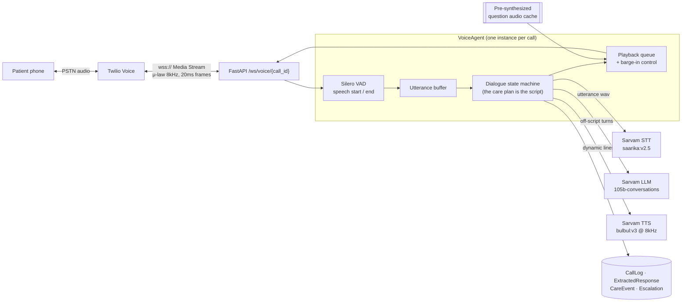
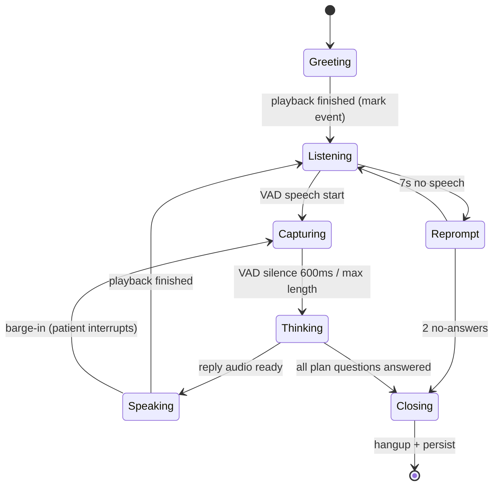

# Real-time voice calls — VAD-based conversational IVR

> **Status: built and verified end to end** (9 Aug 2026). What follows is both the
> design and the as-built description; §9 and §14 are the parts to read first if you
> just want to place a live call.
> Companion to `plan.md` §9 (telephony) and §17 (scheduling).
> All latency numbers below were **measured** against the live Sarvam account using
> `backend/bench_voice.py`, not estimated.

---

## 1. What changed

| | Before | Now |
|---|---|---|
| Call audio | One-shot: `<Play>` a WAV, then `<Record>` for up to 60s | Continuous bidirectional audio stream |
| Turn-taking | Fixed 5s silence timeout baked into TwiML | **VAD decides** when the patient stopped talking |
| Turns per call | Exactly one (speak → record → hang up) | Unlimited — a real back-and-forth conversation |
| Interruption | Impossible | **Barge-in**: patient talks over the nurse, nurse stops |
| Reply handling | After the call ends, download recording → STT | Live, mid-call, per utterance |
| Patient hears | A monologue | A conversation that reacts to what they said |

The current design can't be incrementally stretched into a conversation — `<Record>` is
terminal by nature. Real turn-taking requires **Twilio Media Streams**, a bidirectional
WebSocket carrying raw call audio both ways.

---

## 2. Measured reality (the numbers that shape the design)

```
--- LLM: one conversational turn ---
sarvam-105b                max_tokens=150     1.37s   finish=length  content='' (all 150 tokens spent reasoning)
sarvam-105b                max_tokens=400     2.15s   finish=length  content='' (all 400 tokens spent reasoning)
sarvam-105b-conversations  max_tokens=150     0.85s   finish=stop    'How is your knee pain today?'
sarvam-105b-conversations  max_tokens=400     0.78s   finish=stop    'Is your knee pain any better or worse today?'

--- TTS (bulbul:v3, hi-IN) ---
short  (28 chars)  1.35s  ->  2.0s of audio
medium (143 chars) 6.50s  -> 13.1s of audio

--- STT (saarika:v2.5) ---
3.2s Hindi clip    0.86s  ->  correct transcript, language auto-detected
```

Three conclusions that drive everything below:

1. **`sarvam-105b` is unusable in a live call.** It is a reasoning model — it spends its
   entire token budget thinking and returns empty content unless given ~4000 tokens, which
   costs 20–30s. Fine for Brain (offline, quality-critical). Fatal for a phone call.
2. **`sarvam-105b-conversations` is the call model.** Sub-second, no reasoning preamble,
   naturally short spoken replies. This model exists on your account and we are not using it yet.
3. **Keep every spoken line to one sentence.** TTS cost scales with length: 1.35s for a
   sentence, 6.5s for a paragraph. Long scripts are what make IVRs feel dead.

---

## 3. Architecture



**Why a WebSocket and not more TwiML:** TwiML is request/response — the server only gets
control when a verb finishes. A conversation needs the server to hear the caller *while*
it is speaking (that is what barge-in means), which only the Media Stream gives us.

---

## 4. Choosing the VAD

I checked what actually installs on your interpreter (Python **3.14.6**):

| Option | cp314 wheel | Verdict |
|---|---|---|
| `webrtcvad` / `webrtcvad-wheels` | ❌ source-only (`.tar.gz`) | Would need a compiler; also weak on noisy mobile audio |
| **`silero-vad` via `onnxruntime`** | ✅ `onnxruntime-1.28.0-cp314` | **Chosen** — ML-based, robust to background noise, ~1ms per frame on CPU |

Silero runs natively at 8 kHz in 256-sample (32 ms) chunks, which is exactly the shape of
Twilio phone audio — no resampling for the VAD path either.

**Endpointing parameters** (tunable in `.env`):

| Parameter | Default | Meaning |
|---|---|---|
| `VAD_SPEECH_THRESHOLD` | 0.5 | Silero probability above which a frame counts as speech |
| `VAD_START_MS` | 150 | Sustained speech before we declare "patient is talking" |
| `VAD_SILENCE_MS` | 600 | Silence that ends the turn (the single biggest feel knob) |
| `VAD_MAX_UTTERANCE_MS` | 15000 | Hard stop so a monologue still gets processed |
| `VAD_BARGE_IN_MS` | 300 | Speech-over-nurse before we cut the nurse off |

600 ms is the sweet spot: below ~400 ms we clip people who pause mid-sentence; above
~900 ms the nurse feels slow. Elderly patients often pause — we may raise this per patient.

---

## 5. The turn loop



`Thinking` is where the app logic lives, and it is deliberately **not** "ask an LLM what to
say next". The care plan already defines the script — the medicines due in this slot and the
doctor's follow-up questions. So each turn is:

1. Utterance WAV → **STT** → transcript (+ detected language).
2. Transcript → **extraction** → did they take *this* medicine, symptoms, pain score, urgency.
3. **Red-flag check** on every turn (chest pain, breathlessness, fainting → escalate and
   switch to emergency guidance immediately, mid-call).
4. Advance the state machine → next scripted question, or a clarifying re-ask if the answer
   was unclear, or close the call.

The LLM is used for understanding (step 2) and only for *generating* speech when the patient
goes off-script. Scripted questions come from the pre-synthesized cache.

---

## 6. Latency budget — and how we beat it

Naive path, every turn hitting the network:

| Stage | Measured |
|---|---|
| VAD endpoint silence | 0.60s |
| Sarvam STT | 0.86s |
| Sarvam LLM (conversations) | 0.80s |
| Sarvam TTS (one sentence) | 1.35s |
| Twilio round-trip + jitter | ~0.30s |
| **Total** | **≈ 3.9s** |

Nearly 4 seconds of dead air is where a voice bot loses the patient.

**The optimization this app is uniquely suited for:** a care call is *mostly scripted*. When
the scheduler materializes a slot it already knows the exact medicines and the exact
follow-up questions. So we **pre-synthesize the question audio at schedule time**, minutes
before the call, and cache it on disk keyed by `(text, language, speaker)`.

| Turn type | Path | Latency |
|---|---|---|
| Scripted question (the common case) | VAD + STT + cache hit | **≈ 1.7s** |
| Off-script / clarification | VAD + STT + LLM + TTS | ≈ 3.9s |
| Opening greeting | fully pre-rendered | **0s** — starts the instant the call connects |

Further wins, in priority order:
- **Sentence-chunked playback** — start streaming the first sentence while the second is
  still synthesizing.
- **Filler on slow turns** — a pre-rendered "एक मिनट…" if a turn exceeds ~1.2s, which reads
  as natural thinking rather than a dropped line.
- Verify whether Sarvam offers streaming STT/TTS sockets; the batch numbers above already
  meet budget, so this is an optimization, not a dependency.

---

## 7. Audio pipeline

Twilio speaks **μ-law, 8 kHz, mono, 20 ms frames (160 bytes), base64** in both directions.

```
Inbound   Twilio media frame → b64 decode → μ-law → PCM16 8kHz → Silero VAD
                                                  ↘ utterance buffer → WAV → Sarvam STT

Outbound  Sarvam TTS (speech_sample_rate=8000, PCM16) → μ-law → 20ms frames
                                                      → b64 → Twilio media messages
```

Two verified facts that simplify this a lot:

- **Sarvam TTS accepts `speech_sample_rate: 8000`** and returns 8 kHz / 16-bit / mono
  (confirmed today). **No resampling anywhere** — just μ-law conversion.
- `audioop` was removed from the Python 3.13+ stdlib, but **`audioop-lts` ships a
  `cp313-abi3` wheel** that works on 3.14 and provides `lin2ulaw` / `ulaw2lin`.

Outbound audio must be **paced at ~20 ms per frame**, not blasted at once, or Twilio buffers
it and barge-in becomes impossible (we could no longer stop what was already sent).

**Barge-in** works like this: while speaking, if VAD reports sustained speech for
`VAD_BARGE_IN_MS`, we send Twilio a `clear` event to flush its buffer, stop our pacer, and
jump to `Capturing`. Twilio `mark` events tell us when playback genuinely finished, which is
how `Speaking → Listening` is triggered rather than guessing from audio duration.

---

## 8. Data model

Existing files changed: `telephony.py` now emits `<Connect><Stream>` (with `<Play>`+`<Record>`
kept behind `VOICE_MODE=classic`), `sarvam.py` gained 8 kHz TTS and `chat_fast` on
`sarvam-105b-conversations`, and `careplus.create_care_call` is shared by the manual-call
endpoint and the console demo entrypoint.

**New table — `CallTurn`**, so a conversation is inspectable rather than a single blob:

```
CALLTURN
  id             PK
  call_log_id    FK → call_logs
  turn_index     int       -- ordering
  role           str       -- nurse | patient
  step_key       str       -- greeting | med:<id> | q:<id> | emergency | closing
  text           str       -- what was said
  text_english   str       -- doctor-readable mirror
  audio_path     str       -- per-turn audio, replayable in the UI
  language       str
  stt_confidence float
  latency_ms     int       -- per-turn, so responsiveness is measured not claimed
  barge_in       bool      -- did the patient interrupt to say this
  started_at     datetime
```

`GET /calls/{id}` returns `turns`, so a transcript can grow turn by turn in the UI — a much
stronger demo than one block of text at the end. `/voice-console` already renders it that way.

---

## 9. Prerequisites — what actually blocks a live call

The Twilio Console's **Voice → Manage → Make a test call** widget changes the picture.
That widget dials using the console's own session and simply fetches a TwiML URL from
us, so the first real end-to-end call needs **no Account SID and no working REST auth
on our side** — only a publicly reachable URL.

| # | Item | Status |
|---|---|---|
| 1 | **Twilio account is on a trial plan** | ❌ **The real blocker, and it is absolute.** `<Stream>` is on Twilio's [blocked-verb list for trial accounts](https://www.twilio.com/docs/usage/trials/try-out-voice#custom-twiml-during-trial): it is stripped from our TwiML and replaced with *"The Stream verb is not available on trial accounts."* `<Record>` is blocked too, so the classic fallback cannot run either. Upgrading the account (adding a payment method) is the only fix. |
| 1b | **Twilio REST credentials** | ✅ **Working**, using the account's primary auth token (`Client(account_sid, auth_token)`). The Restricted API key `SK45ab…` returned **70051** on every resource because it carried no permission grants, so `TWILIO_API_KEY_SID` is deliberately left blank. |
| 1c | **Trial `calls.create` parameters** | ⚠️ A trial account rejects every Create-a-Call parameter beyond `to`/`from`/`url` with **HTTP 400** *"trial accounts have limited parameter access"* — status callbacks included. `place_call` omits them while `TWILIO_TRIAL_ACCOUNT=true`. The cost is that no status webhook fires, so a twilio-mode call stays `ringing` in our database until the account is upgraded. |
| 2 | **Public HTTPS + WSS tunnel** | ✅ **Up.** A `cloudflared` quick tunnel fronts port 8000 and `PUBLIC_BASE_URL` points at it; the TwiML route and the `wss://` media stream were both verified through it. The hostname is random per start, so restarting the tunnel means updating `PUBLIC_BASE_URL`. `ngrok http 8000` works identically. |
| 3 | **Verified caller ID** | ✅ `+916355351675` already appears as an approved destination in the console's To dropdown. Trial number `+17372212163` is the fixed From. |
| 4 | **India voice termination** | ✅ **Proven, and it was never the problem.** Five outbound calls from the US trial number `+17372212163` to the Indian mobile `+916355351675` all reached `status=completed` with real durations (41s, 9s, 3s, 2s, 7s). TRAI/DLT is not blocking us, so no India-native provider (Exotel, Plivo) is needed. |
| 5 | Dependencies | ✅ Installed and working on Python 3.14: `silero-vad`, `onnxruntime` (cp314), `audioop-lts` (cp313-abi3), `numpy`, `websockets`, `twilio` |
| 6 | Sarvam credits | ✅ Live and working |
| 7 | Plan B, needs nothing | ✅ `GET /voice-console` holds the same conversation through the browser mic — no carrier, no tunnel, no Twilio spend. Working today. |

So: **our side is done; the Twilio account is what blocks a real phone call.** The
browser console at `GET /voice-console` runs the identical agent and needs none of it.

Phone numbers are normalized to E.164 (`to_e164` in `telephony.py`) both when a patient
is saved and again at dial time — Twilio rejects anything else with error 21211, and a
trial account only connects to a verified number matched as an exact string. A dial that
Twilio refuses is persisted as `status="failed"` with the reason in `CallLog.error_message`,
so the call panel says why instead of waiting forever for a reply that cannot come.

### The TwiML webhook has a ~15 second budget

Twilio abandons a call if the TwiML URL does not answer quickly, so nothing on that
path may wait on Sarvam. `/twilio/voice/demo` therefore does only database work —
creating the `CallLog` and its care-plan targets — and answers in well under a second;
the dialogue is translated and pre-rendered in a background task while Twilio is still
dialling. The agent rebuilds the plan itself if a stream somehow connects first, so the
race is safe either way.

The same rule explains the SQLite `database is locked` failures this route used to
return: a write transaction was left open across ~20s of Sarvam calls, and every
concurrent write in that window failed. Slow work now happens before anything is
written.

---

## 10. Failure handling

Every failure keeps the patient in a sane state rather than dropping the call:

| Failure | Behaviour |
|---|---|
| STT returns empty / garbage | Re-prompt once in the patient's language, then move on and mark the question unanswered |
| LLM slow or down | Fall back to the next scripted question from the cache — the call never stalls |
| TTS fails mid-call | Twilio `<Say>` with the patient's BCP-47 language |
| WebSocket drops | Persist the turns captured so far, mark the slot `no_answer`, let the retry/backoff logic re-dial |
| Patient silent twice | Polite close, `missed_dose` event, escalate per the SOP |
| Red-flag symptom | Interrupt the script immediately, speak emergency guidance, raise the escalation before the call ends |
| Media Streams unavailable | `TELEPHONY_MODE=twilio_classic` keeps today's `<Play>`+`<Record>` flow working |

Simulation mode stays exactly as it is, so the demo never hard-depends on telephony.

---

## 11. What was built

| File | Purpose |
|---|---|
| `services/voice/audio.py` | μ-law ↔ PCM16, 20 ms framing, WAV helpers |
| `services/voice/vad.py` | Silero ONNX endpointing (see the two gotchas below) |
| `services/voice/transport.py` | Twilio / browser / test transports, real-time pacing, barge-in |
| `services/voice/dialogue.py` | The care plan rendered as a call script, localized |
| `services/voice/prewarm.py` | On-disk TTS cache, keyed by (text, language, speaker) |
| `services/voice/understand.py` | One fast LLM call per turn + keyword safety net |
| `services/voice/persist.py` | Turns → `CallTurn`, `ExtractedResponse`, `CareEvent`, `Escalation` |
| `services/voice/agent.py` | The turn loop |
| `routers/voice_ws.py` | `/ws/voice/twilio/{id}`, `/ws/voice/browser/{id}` |
| `routers/twilio_webhooks.py` | `/twilio/voice/demo` (console test call), streaming TwiML |
| `app/static/voice_console.html` | Browser mic console at `/voice-console` |
| `test_voice_stream.py` | Fake Twilio that replays audio as media frames |

**Two Silero gotchas that cost real debugging time**, recorded so nobody rediscovers them:

1. The 8 kHz ONNX graph expects the **previous 32 samples prepended** to every 256-sample
   window. Feeding bare windows makes its internal STFT frame against silence, and loud
   speech scores ~0.05. Symptom: the VAD "works" but fires seconds late, on the wrong words.
2. A 20 ms frame is 160 samples, so roughly every third frame **cannot complete a window**.
   Returning 0.0 for those frames resets the speech-run counter and no utterance ever starts.
   Carry the previous probability forward instead.

Silero's 8 kHz probabilities also dip hard between syllables, so endpointing uses hysteresis
(0.5 to start a run, 0.3 to continue) plus an 80 ms gap tolerance.

---

## 12. How it was verified

`backend/test_voice_stream.py` speaks Twilio's Media Streams protocol at the server — `start`
event, real-time μ-law frames, `mark` echoes — and plays scripted patient replies synthesized
with a *different* Sarvam voice, so STT is genuinely exercised rather than fed our own audio.

```bash
python test_voice_stream.py --scenario adherent  --lang hi-IN
python test_voice_stream.py --scenario missed    --lang hi-IN --barge-in 2000
python test_voice_stream.py --scenario emergency --lang hi-IN
```

Observed results:

| Scenario | Outcome |
|---|---|
| adherent | `took_medicine = true` per medicine, graceful close |
| missed (interrupting the nurse after 2s every turn) | 3/3 barge-ins accepted, `took_medicine = false` ×2, symptoms weakness + fever, `urgency = medium` |
| emergency | Script abandoned mid-call, emergency guidance spoken, escalation raised: *"The patient reports severe chest pain and difficulty breathing"* |

Measured per-turn latency, end of patient speech → nurse speaking: **~2.3–2.6s**, of which
STT is 0.7–1.0s and understanding ~0.8s. Cached question audio costs **2 ms** instead of the
1.3s a live TTS round trip would.

---

## 13. Open questions

1. **Conversation depth** — strictly the care-plan questions, or should the patient be able
   to ask things back ("can I take it with tea?") and get a Brain-grounded answer? The latter
   is a great demo moment but adds Brain's 20–30s latency, so it needs a "let me check that"
   holding line.
2. **Languages on the call** — Hindi + Tamil for the demo, or all 23? Any language works
   today; only the pre-synthesis cost scales.
3. **Fallback provider** — if Twilio cannot reach Indian mobiles, is there an Exotel account?
   Otherwise the browser console is the demo path and needs no carrier approval.

---

## 14. Placing a real call (copy-paste)

**1. Expose the backend.** Twilio cannot reach localhost, and Media Streams need `wss://`.

```bash
brew install ngrok
ngrok config add-authtoken <your-token>   # free account, one time
ngrok http 8000
```

**2. Point the backend at the tunnel** — edit `backend/.env` with the `https://` URL ngrok
prints, then restart it:

```bash
PUBLIC_BASE_URL=https://<subdomain>.ngrok-free.app
```

```bash
cd backend && ./.venv/bin/python -m uvicorn app.main:app --host 0.0.0.0 --port 8000
```

Startup must log `Twilio console test URL: …` rather than the `PUBLIC_BASE_URL … is not
reachable` warning. Confirm with `curl localhost:8000/health` → `"public_url_reachable": true`.

**3. In the Twilio Console** → Voice → Manage → **Make a test call**:

| Field | Value |
|---|---|
| Direction | Outbound call |
| To | `+916355351675` |
| From | `+17372212163` (trial number, locked) |
| Test scenario | **Custom** |
| TwiML URL | `https://<subdomain>.ngrok-free.app/twilio/voice/demo` |

Press **Start call**. Add `?lang=ta-IN` to the URL to run the call in another language, or
`?patient_id=2` to call as a different patient; both apply to that call only.

**4. What you should see.** In the backend log, in order:

```
twilio  INFO  console test call → call_id=… patient=Anita Sharma lang=hi-IN stream=wss://…/ws/voice/twilio/…
voice.prewarm INFO  synthesized … bytes for 'Have you taken your Metformin…'
voice.ws     INFO  call … media stream connected
voice.agent  INFO  call … conversation ready: 4 steps in hi-IN
voice.agent  INFO  call … nurse[greeting]: 'नमस्ते अनीता शर्मा…'
voice.agent  INFO  call … patient[med:1]: 'हाँ, ले ली है।' (2400ms utterance, 733ms stt)
voice.agent  INFO  call … nurse[med:2]: '…'
```

And on the phone: a Hindi greeting, then one question at a time, each waiting for you to
finish speaking. Interrupt mid-sentence and it stops — the log prints `barge-in after 400ms`.
Say *"मुझे छाती में बहुत तेज दर्द हो रहा है"* and it abandons the script, speaks emergency
guidance, and raises an escalation visible in the dashboard.

**If the call never connects**, that is blocker #4, not our code: a US trial long-code to an
Indian mobile is frequently blocked. Prove the agent itself with `/voice-console` and plan on
an India-native carrier for production.

**5. No ngrok? Use the browser.** `http://localhost:8000/voice-console` — pick a patient,
click Start call, and talk. Identical agent, identical VAD turn-taking, live transcript.
