# HealthcareOS — Full Technical Plan

**The AI Care Coordination Layer.** Two flagship modules, one closed loop:

- **Brain** — evidence-backed clinical knowledge from your own documents (every answer cited).
- **Patient Care+** — autonomous, multilingual voice follow-up + medication adherence.

Narrative: *trusted knowledge → autonomous multilingual voice engagement → structured data → doctor closes the loop → patient hears back in their own language.* This loop exercises almost the entire Sarvam stack.

> Diagrams below use **Mermaid**. GitHub/VS Code render them inline. For a fully rendered, styled version open **`plan.html`** in a browser.

---

## 1. Locked decisions

| Decision | Choice |
|---|---|
| Backend | **Python + FastAPI** |
| Frontend | **React + Vite + TypeScript + Tailwind** |
| Calls | **Real telephony via Twilio** (turn-based IVR) + **simulation fallback** |
| Scope | **Brain + Patient Care+ + Care Graph + light Analytics** |
| Languages | **Live multi-language** (Hindi, Tamil, Kannada, Marathi, English, …) |
| Storage | **SQLite** via SQLAlchemy (zero-infra, real persistence) |

---

## 2. The full Sarvam stack (grounded in the real API)

Base URL `https://api.sarvam.ai` · Auth header `api-subscription-key`.

| Capability | Endpoint | Model | Used by |
|---|---|---|---|
| Document intelligence (PDF/img → md/json, 23 langs, tables) | `/doc-digitization/job/v1` | Sarvam Vision (3B VLM) | Brain ingestion |
| Chat / reasoning / summaries | `/v1/chat/completions` | `sarvam-105b` | Brain answers, call-script gen, summaries |
| Text → speech (11 langs, 38 voices, base64 WAV) | `/text-to-speech` | `bulbul:v3` | Patient calls, callbacks |
| Speech → text (23 langs, auto-detect + confidence, 5 modes) | `/speech-to-text` | `saaras:v3` | Patient replies |
| Long audio (>30s) STT (diarization, timestamps) | `/speech-to-text/job/init` | `saaras:v3` | Long recordings |
| Structured extraction (typed Q&A) | `/text-analytics` | — | Transcript → symptom/adherence fields |
| Translation (EN ↔ 22 Indic) | `/translate` | `mayura:v1` / `sarvam-translate:v1` | Doctor↔patient language |
| Language identification | `/text-lid` | — | Routing / detection |
| Transliteration (script conversion) | `/transliterate` | — | Display aids, romanization |

**Sarvam TTS voices** (subset of 38): warm female `priya`,`neha`,`pooja`; professional male `aditya`,`rahul`,`kabir`; calm anchor `shreya`,`kavya`,`ritu`; authoritative `vijay`,`gokul`,`anand`; young energetic `tanya`,`suhani`,`niharika`.

**During build:** use the Sarvam **MCP** — `sarvam_code_*` (shapes, snippets, validate, recommend, speakers, pricing) at build-time; `sarvam_tools_*` (stt, tts, translate, vision_extract, text_analytics, llm_complete, identify_language, voice) to live-test before wiring into the backend.

---

## 3. High-level architecture

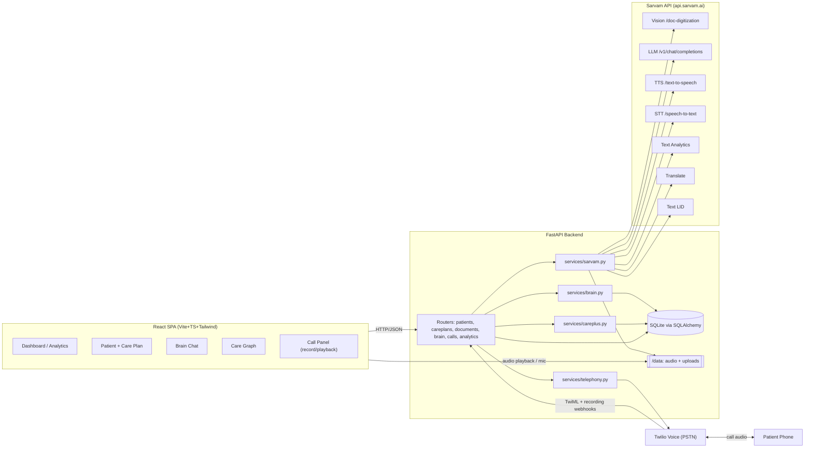

---

## 4. Module flows

### 4.1 Brain — ingest & cited retrieval

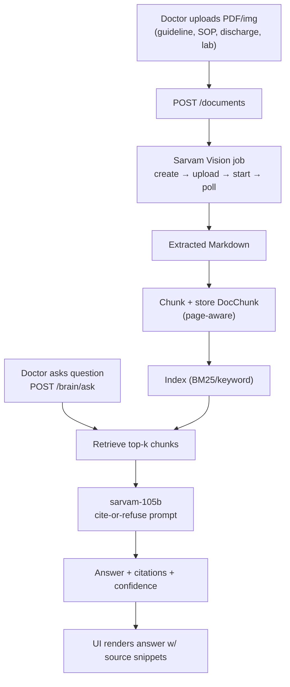

### 4.2 Patient Care+ — autonomous voice follow-up

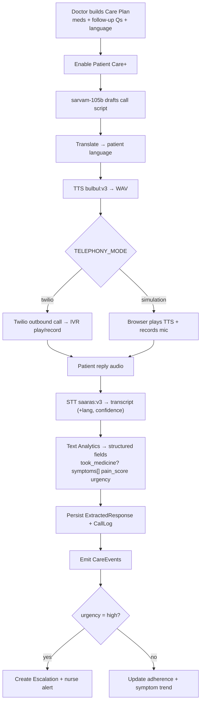

### 4.3 Care Graph — explainable journey

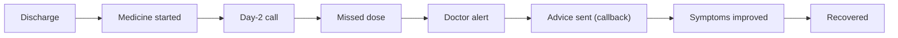

### 4.4 Analytics — hospital view

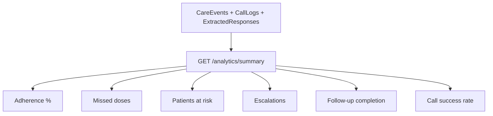

---

## 5. User flow diagrams

### 5.1 Doctor journey

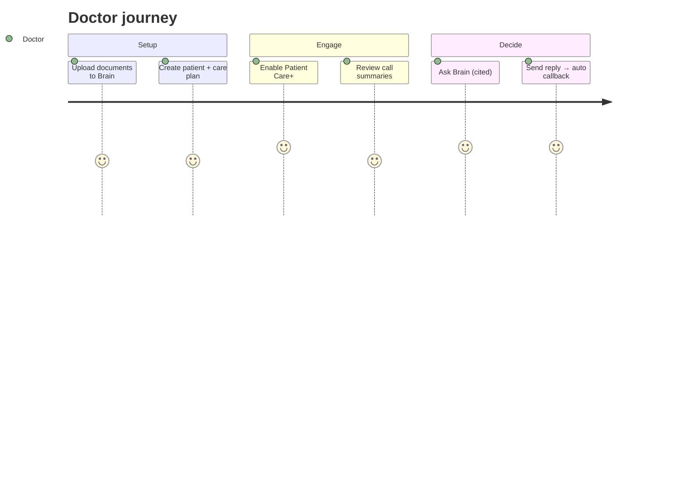

### 5.2 Patient call journey (turn-based)

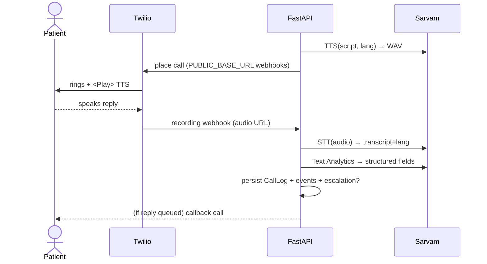

---

## 6. Closed-loop sequence (the demo backbone)

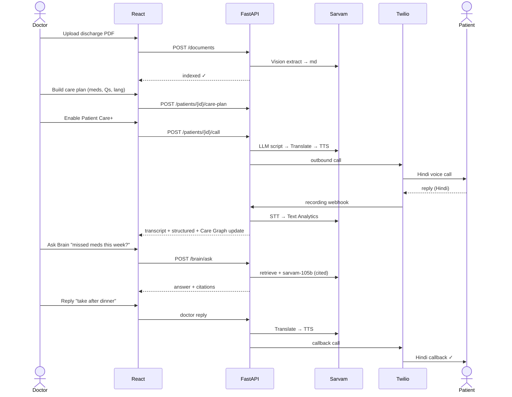

---

## 7. Database schema (ERD)

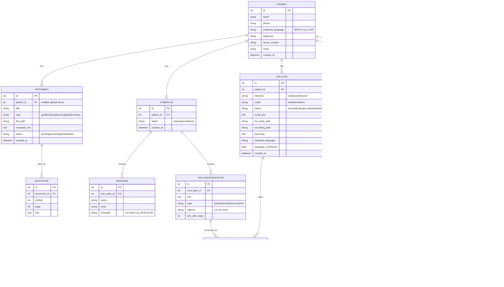

---

## 8. API surface & flows

### 8.1 Endpoint catalog

| Method | Path | Purpose | Sarvam used |
|---|---|---|---|
| POST | `/patients` | Create patient | — |
| GET | `/patients` / `/patients/{id}` | List / detail | — |
| POST | `/patients/{id}/care-plan` | Create/update care plan | — |
| GET | `/patients/{id}/care-plan` | Get care plan | — |
| POST | `/documents` | Upload → Vision extract → index | Vision |
| GET | `/documents` / `/documents/{id}` | List / detail | — |
| POST | `/brain/ask` | Cited Q&A | LLM (+retrieval) |
| POST | `/patients/{id}/call` | Script → translate → TTS → place call | LLM, Translate, TTS |
| POST | `/calls/{id}/simulate-reply` | Upload reply audio → STT → analytics | STT, Text Analytics |
| POST | `/patients/{id}/reply` | Doctor reply → translate → TTS callback | Translate, TTS |
| GET | `/patients/{id}/timeline` | Care Graph events | — |
| GET | `/analytics/summary` | Hospital KPIs | — |
| POST | `/twilio/voice/{call_id}` | Returns TwiML (`<Play>`+`<Record>`) | — |
| POST | `/twilio/recording/{call_id}` | Recording → STT → analytics | STT, Text Analytics |
| POST | `/twilio/status/{call_id}` | Call status updates | — |

### 8.2 Brain ask — request flow

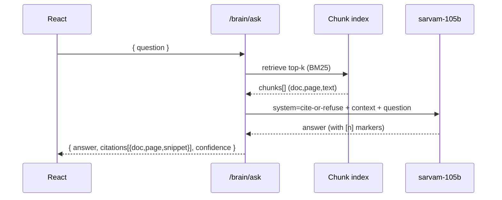

### 8.3 Document ingestion — Vision job pipeline

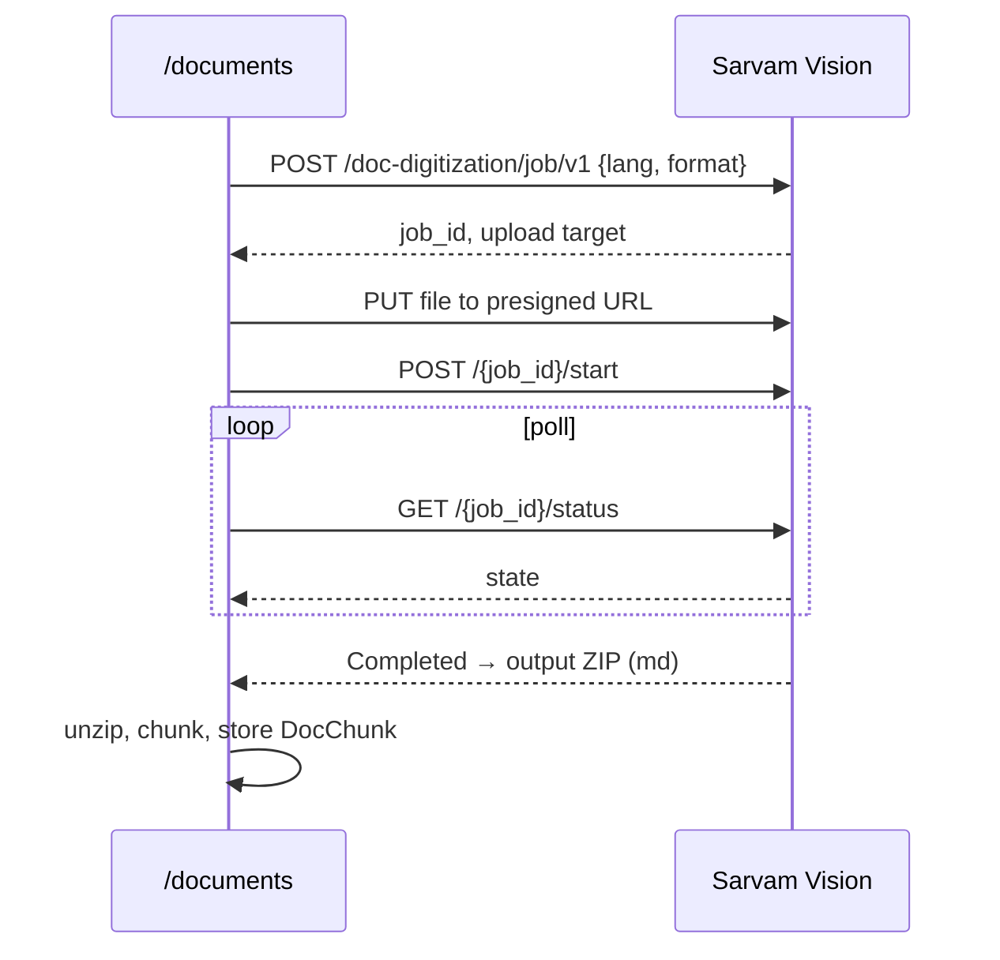

---

## 9. Telephony design (Twilio, turn-based IVR)

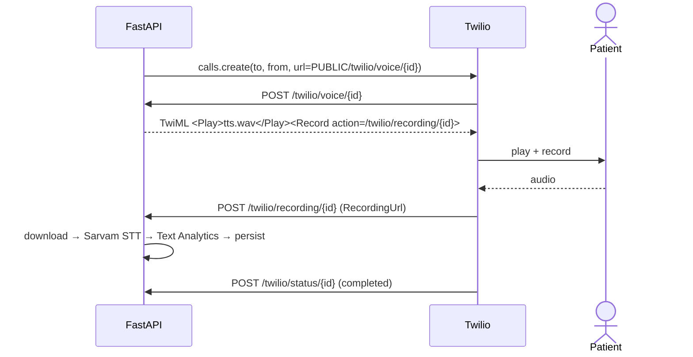

**Prereqs for real calls:** Twilio SID/token + voice number; **ngrok** (`brew install ngrok`, not yet installed) → set `PUBLIC_BASE_URL`. Trial accounts dial only verified numbers; +91 has regulatory limits → consider **Exotel** (India-native) as alternative. Default `TELEPHONY_MODE=simulation` for safe demos.

---

## 10. Repo layout

```
healthcare-os/
├── plan.md · plan.html · README.md
├── backend/
│   ├── requirements.txt · .env.example
│   └── app/
│       ├── main.py · config.py · db.py · models.py · schemas.py · seed.py
│       ├── services/  sarvam.py · brain.py · telephony.py · careplus.py
│       └── routers/   patients.py · careplans.py · documents.py · brain.py · calls.py · analytics.py
└── frontend/
    └── src/
        ├── api/client.ts · lib/languages.ts · lib/audio.ts
        ├── pages/ Dashboard · Patients · PatientDetail · Brain
        └── components/ CarePlanBuilder · CareGraph · CallPanel · BrainChat · Tiles
```

---

## 11. Phased build plan (~8–10 hrs)

| Phase | Work | Est. |
|---|---|---|
| 0 | Scaffold FastAPI + Vite React, config/.env, SQLite, CORS, static mounts | 45m |
| 1 | `services/sarvam.py` wrappers + smoke-test each via MCP | 1h |
| 2 | Brain: upload → Vision → chunk/index → cited Q&A + chat UI | 2h |
| 3 | Care+: profile + care-plan builder → script gen → TTS; STT → analytics → escalation | 2.5h |
| 4 | Telephony: Twilio place-call + TwiML + recording→STT; simulation mode | 1.5h |
| 5 | Care Graph timeline + Analytics dashboard | 1.5h |
| 6 | Close loop (reply → translate → TTS callback) + multi-language + polish | 1.5h |
| 7 | Seed demo data, dark clinical UI, README + demo script + Twilio/ngrok docs | 45m |

Core loop works end-to-end (simulation) by end of Phase 4; Twilio upgrades it to real calls.

---

## 12. Risks & mitigations

| Risk | Mitigation |
|---|---|
| Live call fails on stage | Simulation mode + pre-recorded reply clip |
| Vision job latency/timeout | Pre-ingest demo docs; allow text/markdown upload fallback |
| STT wrong language | Pass patient `preferred_language` hint; show detected lang + confidence |
| TTS 500-char/call limit | Chunk scripts; keep them short + natural |
| Rate limits mid-demo | Cache/pre-generate audio; retry w/ backoff |
| Scope creep | Freeze to Brain + Care+ + Care Graph + Analytics |

---

## 13. Demo script (3 min)

1. Upload discharge summary → Brain ingests (Vision).
2. Build care plan (Metformin + 3 Qs), language = Hindi → Enable Patient Care+.
3. Call fires → natural Hindi TTS (Bulbul + Translate).
4. Patient replies in Hindi → transcript + structured symptoms; switch a 2nd patient to Tamil for **live multi-language** (Saaras + Text Analytics + LID).
5. "Severe chest pain" reply → red escalation on dashboard + Care Graph.
6. Ask Brain "Any missed meds this week?" → cited answer.
7. Doctor replies → automated Hindi callback. **Loop closed.**

---

## 14. To start building

1. Approve plan → I scaffold Phase 0.
2. Twilio creds **or** start in **simulation** (wire Twilio later).
3. Sample clinical PDFs to seed Brain, or I generate realistic dummies.
4. Demo languages beyond Hindi (Tamil / Kannada / Marathi).

---

## 15. End-to-end journey — from patient to hospital

This is the full lifecycle of one patient (Mrs. Sharma, diabetic, Hindi-speaking) through HealthcareOS — and how **every feature and Sarvam capability** is exercised, from bedside to hospital boardroom.

### 15.1 The journey at a glance (swimlanes)

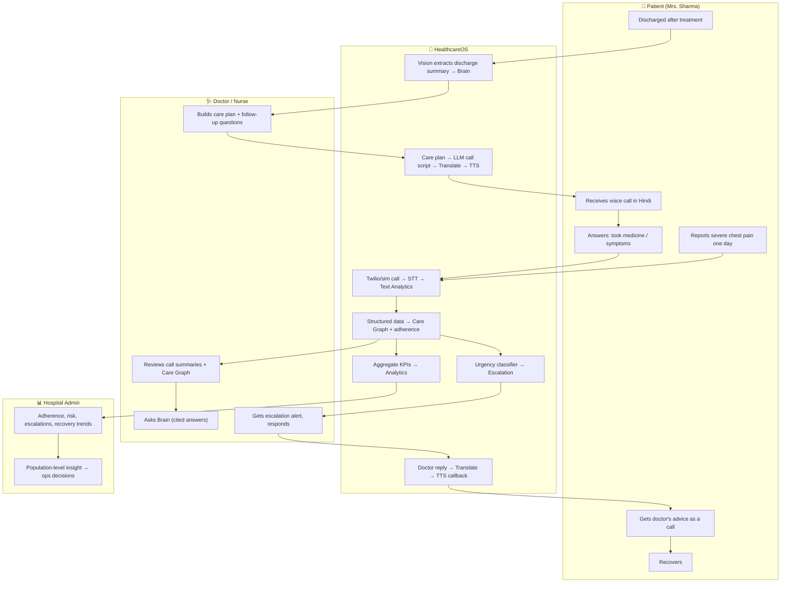

### 15.2 Stage-by-stage — every feature mapped

| # | Stage | Actor | HealthcareOS feature / module | Sarvam capability | Output |
|---|---|---|---|---|---|
| 1 | **Admission & discharge** | Hospital | Document upload → **Brain** ingestion | **Vision** (`/doc-digitization`) | Discharge summary + labs → searchable, cited knowledge |
| 2 | **Knowledge grounding** | Doctor | **Brain** indexes SOPs, guidelines, formularies | Vision + chunk/index | Hospital-specific evidence base |
| 3 | **Care plan design** | Doctor | **Care Plan builder** (meds, schedule, follow-up Qs, language) | — | Structured plan tied to patient's `preferred_language` |
| 4 | **Activation** | HealthcareOS | **Enable Patient Care+** → call-script generation | **LLM** `sarvam-105b` | Warm, clinically-safe script |
| 5 | **Localization** | HealthcareOS | Script → patient's language | **Translate** (`mayura`/`sarvam-translate`) | Hindi/Tamil/… script |
| 6 | **Voice call** | Patient | Autonomous **medicine call** | **TTS** `bulbul:v3` + **Twilio** IVR | Natural spoken call ("time for your Metformin") |
| 7 | **Listening** | Patient | Patient answers by voice | **STT** `saaras:v3` (auto-detect + confidence) | Transcript + detected language |
| 8 | **Understanding** | HealthcareOS | Turn transcript → structured fields | **Text Analytics** (typed Q&A) | took_medicine?, symptoms[], pain_score, urgency |
| 9 | **Adherence tracking** | HealthcareOS | Missed-dose detection + adherence score | — | Adherence %, missed-dose events, caregiver notify |
| 10 | **Symptom follow-up** | Patient | Dynamic follow-up questions (doctor-authored) | TTS + STT + Text Analytics | Symptom timeline (nausea, swelling, fever…) |
| 11 | **Care Graph** | Doctor | Visual **explainable journey** | — | Discharge → med → call → missed → alert → advice → recovered |
| 12 | **Escalation** | Nurse | Urgency classification of "severe chest pain" | LLM + Text Analytics | Red alert, nurse notified, emergency guidance |
| 13 | **Doctor Q&A** | Doctor | **Brain** query over transcripts + plan | LLM (cite-or-refuse) | "Missed 2 doses this week" — with citations |
| 14 | **Closed loop** | Patient | Doctor reply → automated callback | Translate + TTS + Twilio | "Doctor advises: take after dinner" (in Hindi) |
| 15 | **Multi-language** | Any patient | Same loop in Tamil/Kannada/Marathi live | LID + STT + Translate + TTS | One platform, many languages |
| 16 | **Recovery** | Patient | Journey marked complete | — | `recovered` CareEvent closes the graph |
| 17 | **Hospital intelligence** | Admin | **Analytics** dashboard | — (aggregates) | Adherence %, at-risk patients, escalations, recovery trend, call success rate |

### 15.3 Value delivered at each level

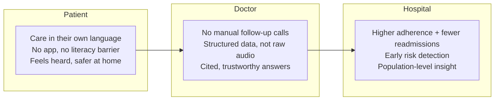

### 15.4 One sentence for the judges

> A patient is discharged, and from that moment HealthcareOS **reads their records (Vision)**, **plans and speaks to them in their language (LLM + Translate + TTS)**, **listens and understands their replies (STT + Text Analytics)**, **draws their recovery as an explainable Care Graph**, **escalates danger instantly**, **lets the doctor answer with cited evidence (Brain)**, **closes the loop with an automated callback**, and **rolls it all up into hospital-wide intelligence** — the entire arc from a single bedside to the hospital boardroom, powered end-to-end by Sarvam.
