# HealthcareOS — Full Technical Plan

**The AI Care Coordination Layer.** Two flagship modules, one closed loop:

- **Brain** — evidence-backed clinical knowledge from your own documents (every answer cited).
- **Patient Care+** — autonomous, multilingual voice follow-up + medication adherence.

Narrative: *trusted knowledge → autonomous multilingual voice engagement → structured data → doctor closes the loop → patient hears back in their own language.* This loop exercises almost the entire Sarvam stack.

> Diagrams below use **Mermaid**. GitHub/VS Code render them inline. For a fully rendered, styled version open **`plan.html`** in a browser.

---

## 1. Locked decisions

| Decision | Choice |
|---|---|
| Backend | **Python + FastAPI** |
| Frontend | **React + Vite + TypeScript + Tailwind** |
| Calls | **Real telephony via Twilio** (turn-based IVR) + **simulation fallback** |
| Scope | **Brain + Patient Care+ + Care Graph + light Analytics** |
| Languages | **Live multi-language** (Hindi, Tamil, Kannada, Marathi, English, …) |
| Storage | **SQLite** via SQLAlchemy (zero-infra, real persistence) |

---

## 2. The full Sarvam stack (grounded in the real API)

Base URL `https://api.sarvam.ai` · Auth header `api-subscription-key`.

| Capability | Endpoint | Model | Used by |
|---|---|---|---|
| Document intelligence (PDF/img → md/json, 23 langs, tables) | `/doc-digitization/job/v1` | Sarvam Vision (3B VLM) | Brain ingestion |
| Chat / reasoning / summaries | `/v1/chat/completions` | `sarvam-105b` | Brain answers, call-script gen, summaries |
| Text → speech (11 langs, 38 voices, base64 WAV) | `/text-to-speech` | `bulbul:v3` | Patient calls, callbacks |
| Speech → text (23 langs, auto-detect + confidence, 5 modes) | `/speech-to-text` | `saaras:v3` | Patient replies |
| Long audio (>30s) STT (diarization, timestamps) | `/speech-to-text/job/init` | `saaras:v3` | Long recordings |
| Structured extraction (typed Q&A) | `/text-analytics` | — | Transcript → symptom/adherence fields |
| Translation (EN ↔ 22 Indic) | `/translate` | `mayura:v1` / `sarvam-translate:v1` | Doctor↔patient language |
| Language identification | `/text-lid` | — | Routing / detection |
| Transliteration (script conversion) | `/transliterate` | — | Display aids, romanization |

**Sarvam TTS voices** (subset of 38): warm female `priya`,`neha`,`pooja`; professional male `aditya`,`rahul`,`kabir`; calm anchor `shreya`,`kavya`,`ritu`; authoritative `vijay`,`gokul`,`anand`; young energetic `tanya`,`suhani`,`niharika`.

**During build:** use the Sarvam **MCP** — `sarvam_code_*` (shapes, snippets, validate, recommend, speakers, pricing) at build-time; `sarvam_tools_*` (stt, tts, translate, vision_extract, text_analytics, llm_complete, identify_language, voice) to live-test before wiring into the backend.

---

## 3. High-level architecture

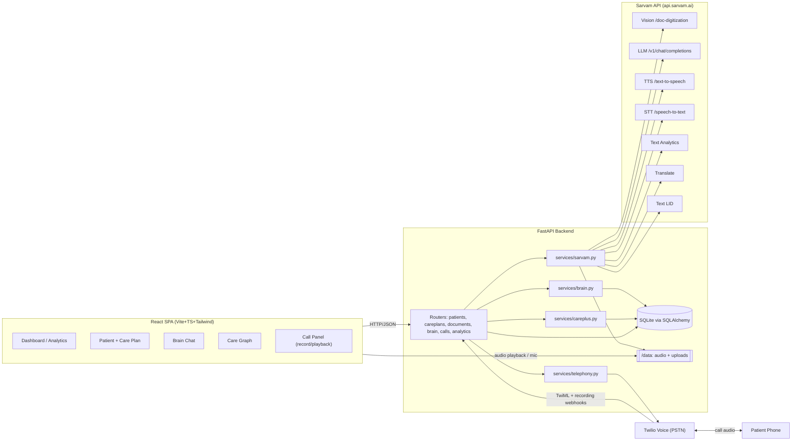

---

## 4. Module flows

### 4.1 Brain — ingest & cited retrieval

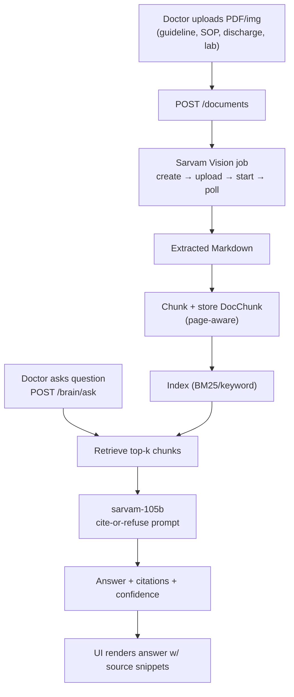

### 4.2 Patient Care+ — autonomous voice follow-up

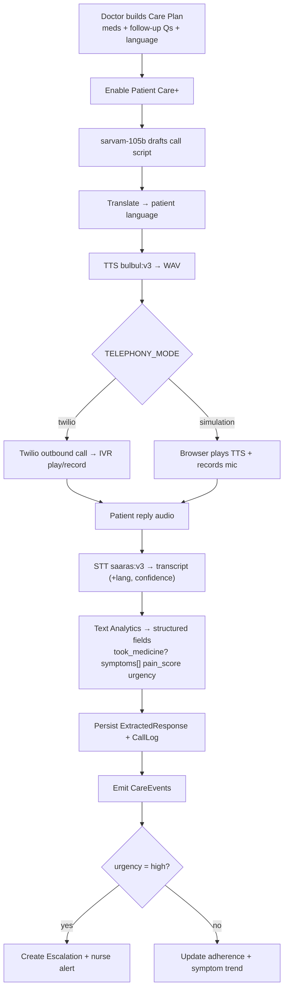

### 4.3 Care Graph — explainable journey

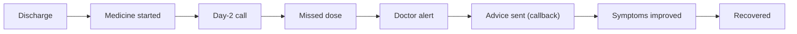

### 4.4 Analytics — hospital view

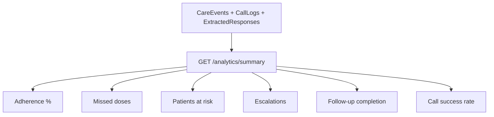

---

## 5. User flow diagrams

### 5.1 Doctor journey

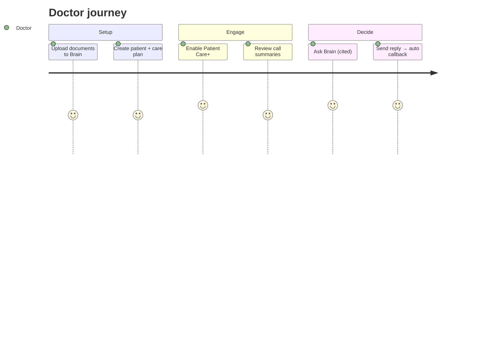

### 5.2 Patient call journey (turn-based)

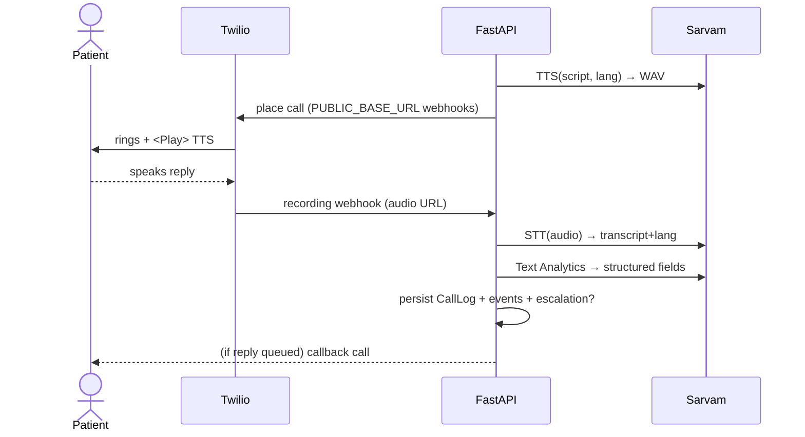

---

## 6. Closed-loop sequence (the demo backbone)

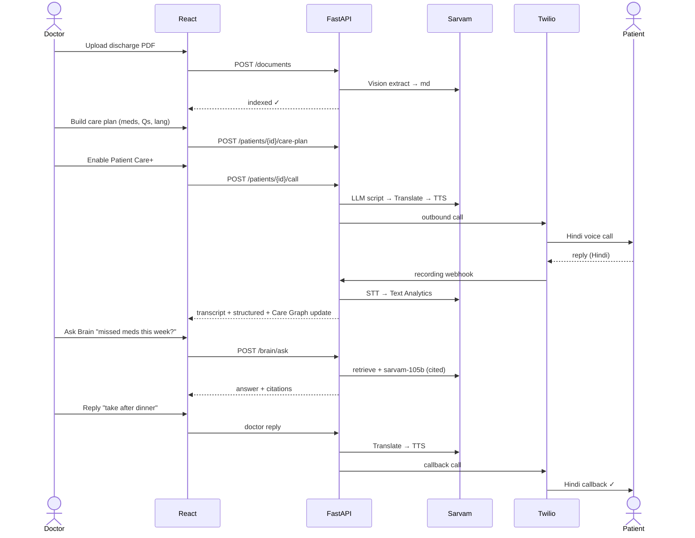

---

## 7. Database schema (ERD)

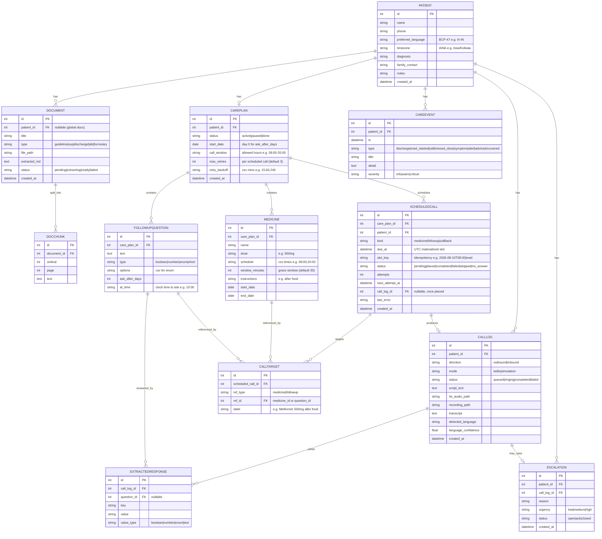

---

## 8. API surface & flows

### 8.1 Endpoint catalog

| Method | Path | Purpose | Sarvam used |
|---|---|---|---|
| POST | `/patients` | Create patient | — |
| GET | `/patients` / `/patients/{id}` | List / detail | — |
| POST | `/patients/{id}/care-plan` | Create/update care plan | — |
| GET | `/patients/{id}/care-plan` | Get care plan | — |
| POST | `/documents` | Upload → Vision extract → index | Vision |
| GET | `/documents` / `/documents/{id}` | List / detail | — |
| POST | `/brain/ask` | Cited Q&A | LLM (+retrieval) |
| POST | `/patients/{id}/call` | Script → translate → TTS → place call | LLM, Translate, TTS |
| POST | `/calls/{id}/simulate-reply` | Upload reply audio → STT → analytics | STT, Text Analytics |
| POST | `/patients/{id}/reply` | Doctor reply → translate → TTS callback | Translate, TTS |
| GET | `/patients/{id}/timeline` | Care Graph events | — |
| GET | `/analytics/summary` | Hospital KPIs | — |
| POST | `/twilio/voice/{call_id}` | Returns TwiML (`<Play>`+`<Record>`) | — |
| POST | `/twilio/recording/{call_id}` | Recording → STT → analytics | STT, Text Analytics |
| POST | `/twilio/status/{call_id}` | Call status updates | — |

### 8.2 Brain ask — request flow

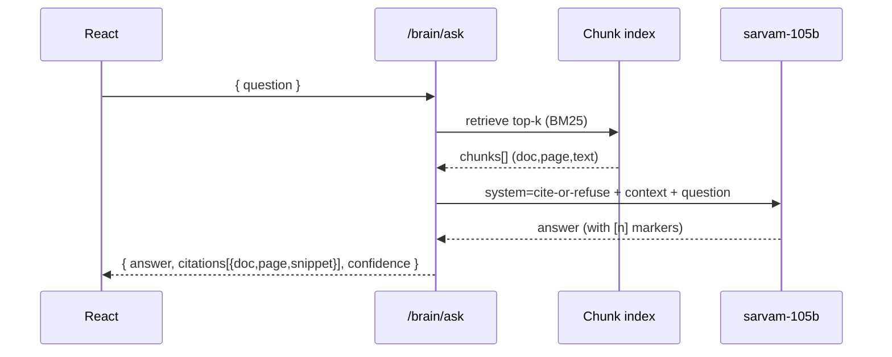

### 8.3 Document ingestion — Vision job pipeline

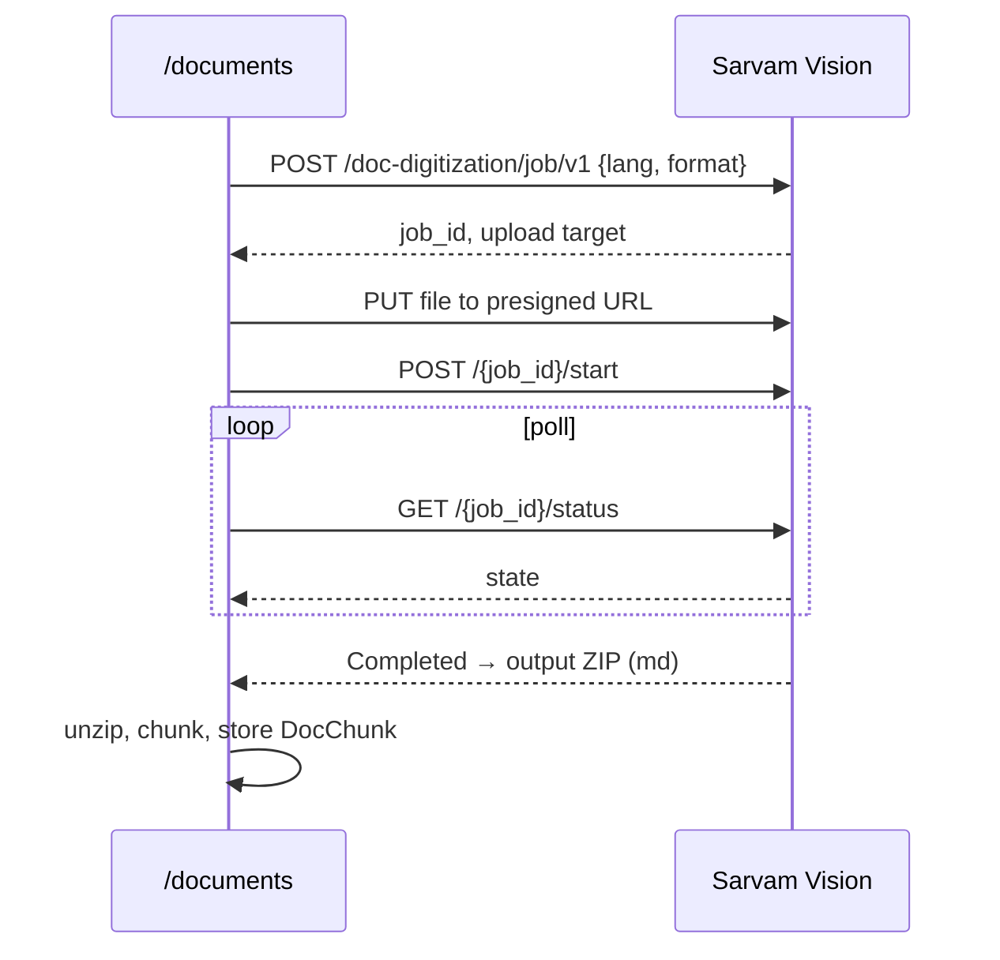

---

## 9. Telephony design (Twilio, turn-based IVR)

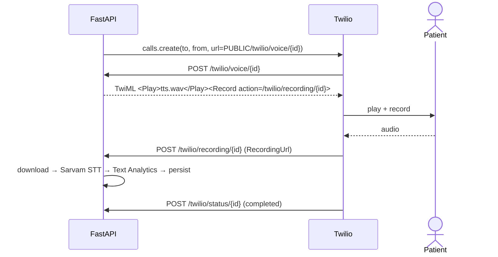

**Prereqs for real calls:** Twilio SID/token + voice number; **ngrok** (`brew install ngrok`, not yet installed) → set `PUBLIC_BASE_URL`. Trial accounts dial only verified numbers; +91 has regulatory limits → consider **Exotel** (India-native) as alternative. Default `TELEPHONY_MODE=simulation` for safe demos.

---

## 10. Repo layout

```
healthcare-os/
├── plan.md · plan.html · README.md
├── backend/
│   ├── requirements.txt · .env.example
│   └── app/
│       ├── main.py · config.py · db.py · models.py · schemas.py · seed.py
│       ├── services/  sarvam.py · brain.py · telephony.py · careplus.py
│       └── routers/   patients.py · careplans.py · documents.py · brain.py · calls.py · analytics.py
└── frontend/
    └── src/
        ├── api/client.ts · lib/languages.ts · lib/audio.ts
        ├── pages/ Dashboard · Patients · PatientDetail · Brain
        └── components/ CarePlanBuilder · CareGraph · CallPanel · BrainChat · Tiles
```

---

## 11. Phased build plan (~8–10 hrs)

| Phase | Work | Est. |
|---|---|---|
| 0 | Scaffold FastAPI + Vite React, config/.env, SQLite, CORS, static mounts | 45m |
| 1 | `services/sarvam.py` wrappers + smoke-test each via MCP | 1h |
| 2 | Brain: upload → Vision → chunk/index → cited Q&A + chat UI | 2h |
| 3 | Care+: profile + care-plan builder → script gen → TTS; STT → analytics → escalation | 2.5h |
| 4 | Telephony: Twilio place-call + TwiML + recording→STT; simulation mode | 1.5h |
| 5 | Care Graph timeline + Analytics dashboard | 1.5h |
| 6 | Close loop (reply → translate → TTS callback) + multi-language + polish | 1.5h |
| 7 | Seed demo data, dark clinical UI, README + demo script + Twilio/ngrok docs | 45m |

Core loop works end-to-end (simulation) by end of Phase 4; Twilio upgrades it to real calls.

---

## 12. Risks & mitigations

| Risk | Mitigation |
|---|---|
| Live call fails on stage | Simulation mode + pre-recorded reply clip |
| Vision job latency/timeout | Pre-ingest demo docs; allow text/markdown upload fallback |
| STT wrong language | Pass patient `preferred_language` hint; show detected lang + confidence |
| TTS 500-char/call limit | Chunk scripts; keep them short + natural |
| Rate limits mid-demo | Cache/pre-generate audio; retry w/ backoff |
| Scope creep | Freeze to Brain + Care+ + Care Graph + Analytics |

---

## 13. Demo script (3 min)

1. Upload discharge summary → Brain ingests (Vision).
2. Build care plan (Metformin + 3 Qs), language = Hindi → Enable Patient Care+.
3. Call fires → natural Hindi TTS (Bulbul + Translate).
4. Patient replies in Hindi → transcript + structured symptoms; switch a 2nd patient to Tamil for **live multi-language** (Saaras + Text Analytics + LID).
5. "Severe chest pain" reply → red escalation on dashboard + Care Graph.
6. Ask Brain "Any missed meds this week?" → cited answer.
7. Doctor replies → automated Hindi callback. **Loop closed.**

---

## 14. To start building

1. Approve plan → I scaffold Phase 0.
2. Twilio creds **or** start in **simulation** (wire Twilio later).
3. Sample clinical PDFs to seed Brain, or I generate realistic dummies.
4. Demo languages beyond Hindi (Tamil / Kannada / Marathi).

---

## 15. End-to-end journey — from patient to hospital

This is the full lifecycle of one patient (Mrs. Sharma, diabetic, Hindi-speaking) through HealthcareOS — and how **every feature and Sarvam capability** is exercised, from bedside to hospital boardroom.

### 15.1 The journey at a glance (swimlanes)

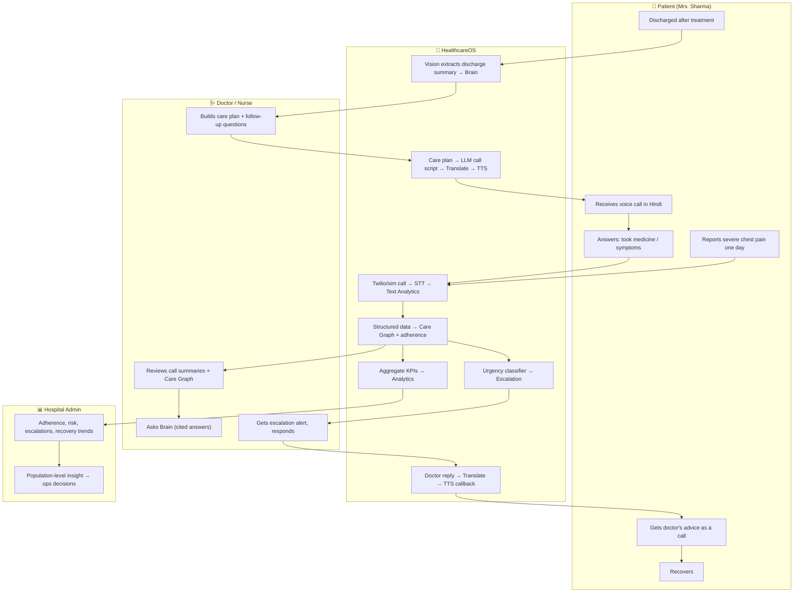

### 15.2 Stage-by-stage — every feature mapped

| # | Stage | Actor | HealthcareOS feature / module | Sarvam capability | Output |
|---|---|---|---|---|---|
| 1 | **Admission & discharge** | Hospital | Document upload → **Brain** ingestion | **Vision** (`/doc-digitization`) | Discharge summary + labs → searchable, cited knowledge |
| 2 | **Knowledge grounding** | Doctor | **Brain** indexes SOPs, guidelines, formularies | Vision + chunk/index | Hospital-specific evidence base |
| 3 | **Care plan design** | Doctor | **Care Plan builder** (meds, schedule, follow-up Qs, language) | — | Structured plan tied to patient's `preferred_language` |
| 4 | **Activation** | HealthcareOS | **Enable Patient Care+** → call-script generation | **LLM** `sarvam-105b` | Warm, clinically-safe script |
| 5 | **Localization** | HealthcareOS | Script → patient's language | **Translate** (`mayura`/`sarvam-translate`) | Hindi/Tamil/… script |
| 6 | **Voice call** | Patient | Autonomous **medicine call** | **TTS** `bulbul:v3` + **Twilio** IVR | Natural spoken call ("time for your Metformin") |
| 7 | **Listening** | Patient | Patient answers by voice | **STT** `saaras:v3` (auto-detect + confidence) | Transcript + detected language |
| 8 | **Understanding** | HealthcareOS | Turn transcript → structured fields | **Text Analytics** (typed Q&A) | took_medicine?, symptoms[], pain_score, urgency |
| 9 | **Adherence tracking** | HealthcareOS | Missed-dose detection + adherence score | — | Adherence %, missed-dose events, caregiver notify |
| 10 | **Symptom follow-up** | Patient | Dynamic follow-up questions (doctor-authored) | TTS + STT + Text Analytics | Symptom timeline (nausea, swelling, fever…) |
| 11 | **Care Graph** | Doctor | Visual **explainable journey** | — | Discharge → med → call → missed → alert → advice → recovered |
| 12 | **Escalation** | Nurse | Urgency classification of "severe chest pain" | LLM + Text Analytics | Red alert, nurse notified, emergency guidance |
| 13 | **Doctor Q&A** | Doctor | **Brain** query over transcripts + plan | LLM (cite-or-refuse) | "Missed 2 doses this week" — with citations |
| 14 | **Closed loop** | Patient | Doctor reply → automated callback | Translate + TTS + Twilio | "Doctor advises: take after dinner" (in Hindi) |
| 15 | **Multi-language** | Any patient | Same loop in Tamil/Kannada/Marathi live | LID + STT + Translate + TTS | One platform, many languages |
| 16 | **Recovery** | Patient | Journey marked complete | — | `recovered` CareEvent closes the graph |
| 17 | **Hospital intelligence** | Admin | **Analytics** dashboard | — (aggregates) | Adherence %, at-risk patients, escalations, recovery trend, call success rate |

### 15.3 Value delivered at each level

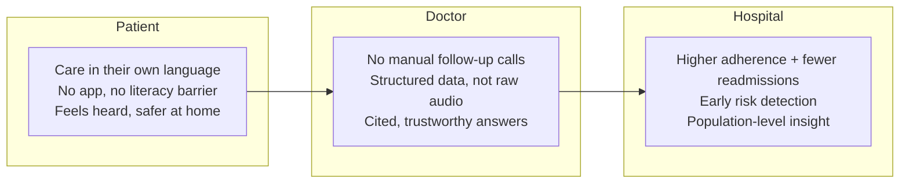

### 15.4 One sentence for the judges

> A patient is discharged, and from that moment HealthcareOS **reads their records (Vision)**, **plans and speaks to them in their language (LLM + Translate + TTS)**, **listens and understands their replies (STT + Text Analytics)**, **draws their recovery as an explainable Care Graph**, **escalates danger instantly**, **lets the doctor answer with cited evidence (Brain)**, **closes the loop with an automated callback**, and **rolls it all up into hospital-wide intelligence** — the entire arc from a single bedside to the hospital boardroom, powered end-to-end by Sarvam.

---

## 16. Frontend plan

### 16.1 Stack & libraries

| Concern | Choice | Why |
|---|---|---|
| Framework | **React 18 + Vite + TypeScript** | Fast HMR, tiny config, great DX |
| Styling | **Tailwind CSS** + **shadcn/ui** (Radix) | Beautiful, accessible components fast |
| Routing | **React Router v6** | Standard SPA routing |
| Server state | **TanStack Query** | Caching, refetch, loading/error states |
| Client state | **Zustand** (light) | Selected patient, language, call session |
| Charts | **Recharts** | Analytics tiles + trends |
| Timeline / graph | **Custom + framer-motion** | Care Graph animation |
| Icons | **lucide-react** | Clean clinical iconography |
| Audio | **MediaRecorder API** + `<audio>` | Record patient reply / play TTS |
| Forms | **react-hook-form + zod** | Care plan builder validation |
| i18n | **i18next** (UI) + Sarvam Translate (content) | Multilingual UI + data |

### 16.2 Design system

- **Theme:** dark clinical — deep navy base (`#0b1220`), panels (`#111a2e`), cyan/violet accents; light mode optional.
- **Typography:** Inter / system UI; numeric tabular for KPIs.
- **Layout:** left sidebar nav + top bar (search + language switcher + notifications) + content area.
- **Language switcher:** global; drives both UI locale (i18next) and default patient call language.
- **Status colors:** adherence good `#34d399`, warn `#fbbf24`, critical `#f87171`; escalations pulse red.
- **Accessibility:** Radix primitives, focus rings, ARIA on audio controls, large tap targets.

### 16.3 Route map

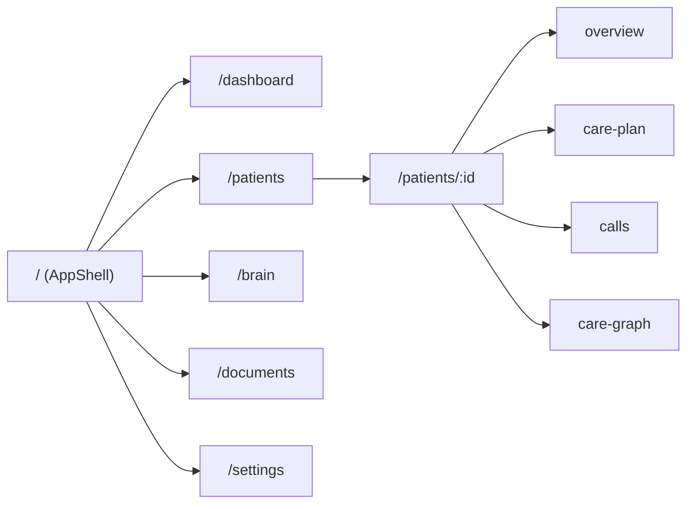

### 16.4 Component tree

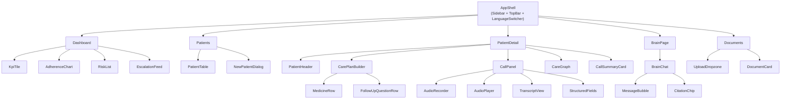

### 16.5 Screen-by-screen

**Dashboard** — hospital command center.
- KPI tiles: adherence %, missed doses, patients at risk, escalations, follow-up completion, call success rate.
- Adherence trend (Recharts line), top diseases, recent escalations feed (live red items).

**Patients** — searchable table (name, diagnosis, language, adherence, risk badge, next follow-up) + "New Patient" dialog.

**Patient Detail** — tabbed:
- *Overview*: profile, current meds, latest AI call summary card (adherence, symptoms, pain, next follow-up).
- *Care Plan*: `CarePlanBuilder` — add medicines (name/dose/schedule) + follow-up questions (typed) + language; "Enable Patient Care+".
- *Calls*: history + `CallPanel` — trigger call, play TTS, record/upload reply, see transcript + structured fields + detected language/confidence.
- *Care Graph*: animated vertical timeline (discharge → med → call → missed → alert → advice → recovered) with severity colors.

**Brain** — chat UI; answers render with inline `CitationChip`s (doc + page) and a confidence bar; source snippets expandable.

**Documents** — drag-drop upload → shows extraction status (pending/extracting/ready) → preview extracted markdown.

### 16.6 The call panel (hero interaction)

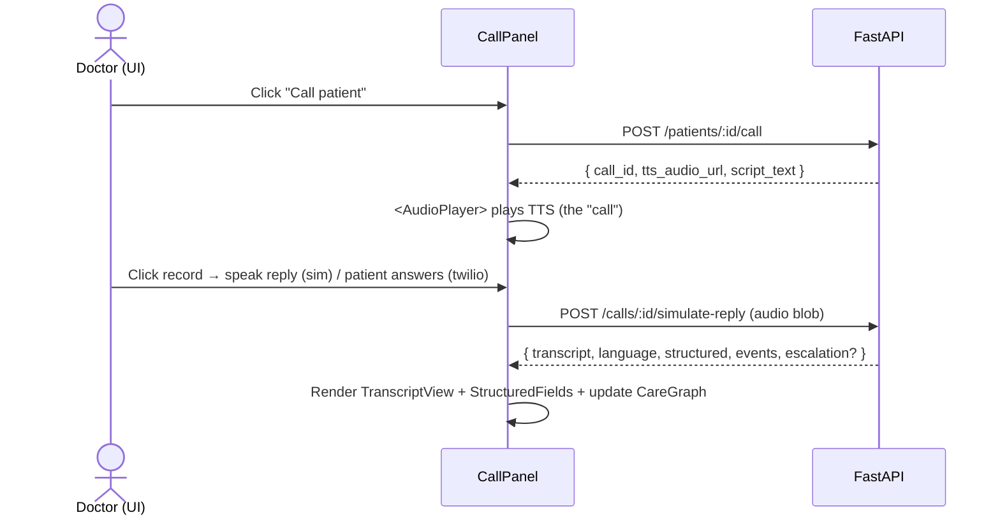

- Simulation mode: `MediaRecorder` captures mic → upload as reply.
- Twilio mode: panel polls `GET /calls/:id` for status/result.
- Live language badge shows Sarvam-detected language + confidence.

### 16.7 State & data flow

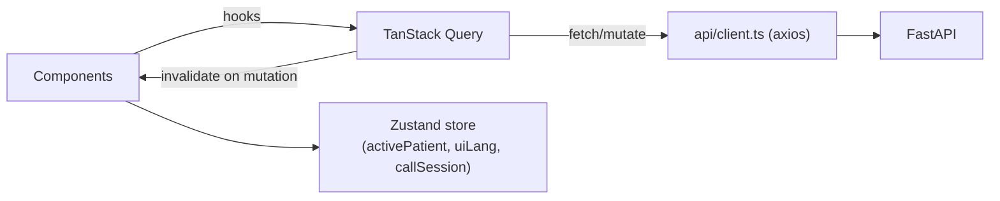

- Query keys: `['patients']`, `['patient', id]`, `['timeline', id]`, `['analytics']`, `['documents']`.
- Mutations (`createCall`, `submitReply`, `askBrain`, `savePlan`, `uploadDoc`) invalidate related keys so UI updates live.
- Optimistic UI on care-plan edits.

### 16.8 Multi-language UI handling

- **UI chrome** localized via i18next (`en`, `hi`, `ta`, …) with a JSON string table — can be auto-generated using Sarvam **Translate/localize**.
- **Dynamic content** (patient replies, doctor advice) translated on demand via backend Sarvam Translate.
- Language switcher in TopBar sets both `uiLang` (i18next) and the default `preferred_language` for new calls.
- Transliteration option to show romanized text alongside native script for reviewers.

### 16.9 Frontend build phases

| Phase | Work |
|---|---|
| F0 | Vite+TS+Tailwind+shadcn scaffold, AppShell, router, theme, api client |
| F1 | Patients list + New Patient + Patient Detail shell |
| F2 | CarePlanBuilder (forms) + Enable Care+ |
| F3 | CallPanel (record/playback, transcript, structured fields) |
| F4 | Care Graph timeline (animated) |
| F5 | Brain chat + citations + Documents upload |
| F6 | Dashboard KPIs + charts |
| F7 | i18n, language switcher, polish, empty/loading/error states |

### 16.10 Folder structure (frontend)

```
frontend/
├── index.html · vite.config.ts · tailwind.config.ts · tsconfig.json
└── src/
    ├── main.tsx · App.tsx · router.tsx
    ├── api/client.ts · api/hooks.ts
    ├── store/useAppStore.ts
    ├── lib/ languages.ts · audio.ts · format.ts
    ├── i18n/ index.ts · locales/{en,hi,ta}.json
    ├── components/
    │   ├── layout/ AppShell · Sidebar · TopBar · LanguageSwitcher
    │   ├── patients/ PatientTable · NewPatientDialog · PatientHeader
    │   ├── care/ CarePlanBuilder · MedicineRow · FollowUpQuestionRow
    │   ├── calls/ CallPanel · AudioRecorder · AudioPlayer · TranscriptView · StructuredFields · CallSummaryCard
    │   ├── graph/ CareGraph · TimelineNode
    │   ├── brain/ BrainChat · MessageBubble · CitationChip
    │   ├── documents/ UploadDropzone · DocumentCard
    │   └── ui/ (shadcn primitives) · KpiTile · Charts
    └── pages/ Dashboard · Patients · PatientDetail · Brain · Documents · Settings
```

---

## 17. Call scheduling engine (cron)

Calls are **not** hard-coded — they are generated from what the doctor configures on the dashboard. The **Care Plan builder is the single source of truth**: medicines + their times, follow-up questions + their day/time, the patient's language, timezone and allowed call window. A background **cron/APScheduler** worker reads that config, materializes concrete due slots, and places one call per due slot — and **each call is about the specific medicine(s) of that specific patient due at that moment**.

### 17.1 Dashboard is the source of truth

| Dashboard field (Care Plan builder) | Persisted to | Drives |
|---|---|---|
| Medicine name + dose + **schedule times** (e.g. `08:00,20:00`) | `Medicine.name/dose/schedule` | When + what to say in medicine calls |
| Medicine **instructions** (e.g. "after food") | `Medicine.instructions` | Spoken in the call script |
| Medicine **grace window** | `Medicine.window_minutes` | How late a dose can still be placed |
| Medicine **start/end date** | `Medicine.start_date/end_date` | Active date range for that drug |
| Follow-up question + **ask_after_days** + **at_time** | `FollowUpQuestion.*` | When follow-up calls fire |
| Patient **language** | `Patient.preferred_language` | TTS/Translate/STT language |
| Patient **timezone** | `Patient.timezone` | Local-time → UTC slot conversion |
| **Call window** (allowed hours) | `CarePlan.call_window` | No calls outside e.g. 08:00–20:00 |
| **Retries / backoff** | `CarePlan.max_retries/retry_backoff` | No-answer / failure handling |

Whenever the doctor **saves the plan** (or clicks **Enable Patient Care+**), the backend (re)materializes upcoming `ScheduledCall` rows for the next horizon (e.g. next 24–48h). Editing the plan re-syncs future pending slots (past/placed slots are never rewritten).

### 17.2 Data model for scheduling

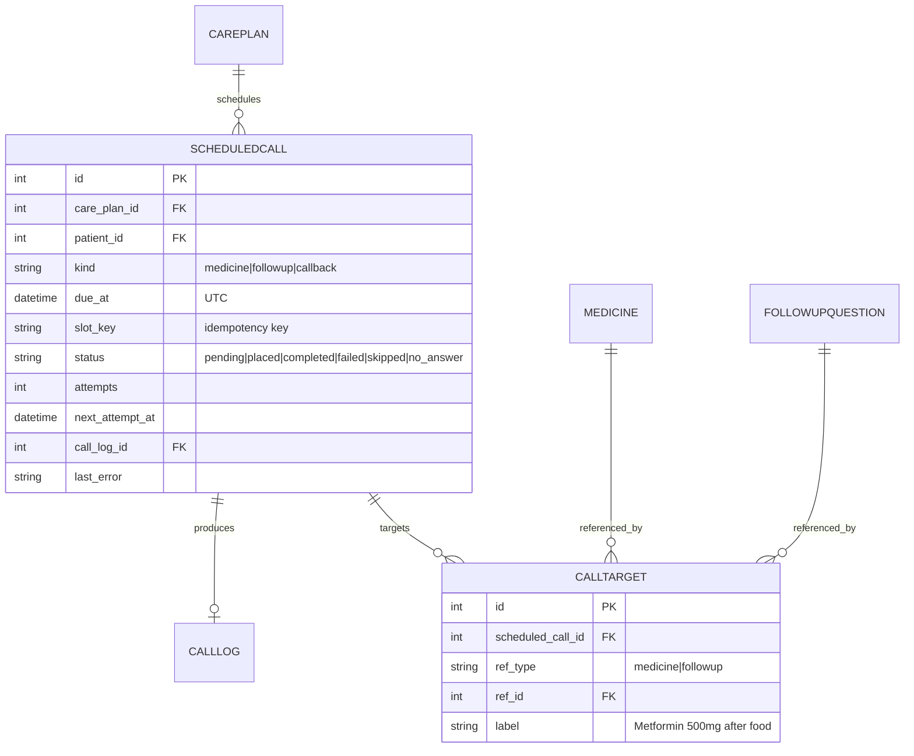

- A **`ScheduledCall`** = one call to place at `due_at`.
- Its **`CALLTARGET`** rows say **which medicines/questions this call is about** — so the same 08:00 call can cover *Metformin 500mg + Amlodipine 5mg* together, while the 20:00 call covers only the evening dose.
- `slot_key` (e.g. `patient42|2026-08-10T08:00|medicine`) guarantees **idempotency** — the cron can run every minute and never double-book the same dose.

### 17.3 Materialization: dashboard config → concrete slots

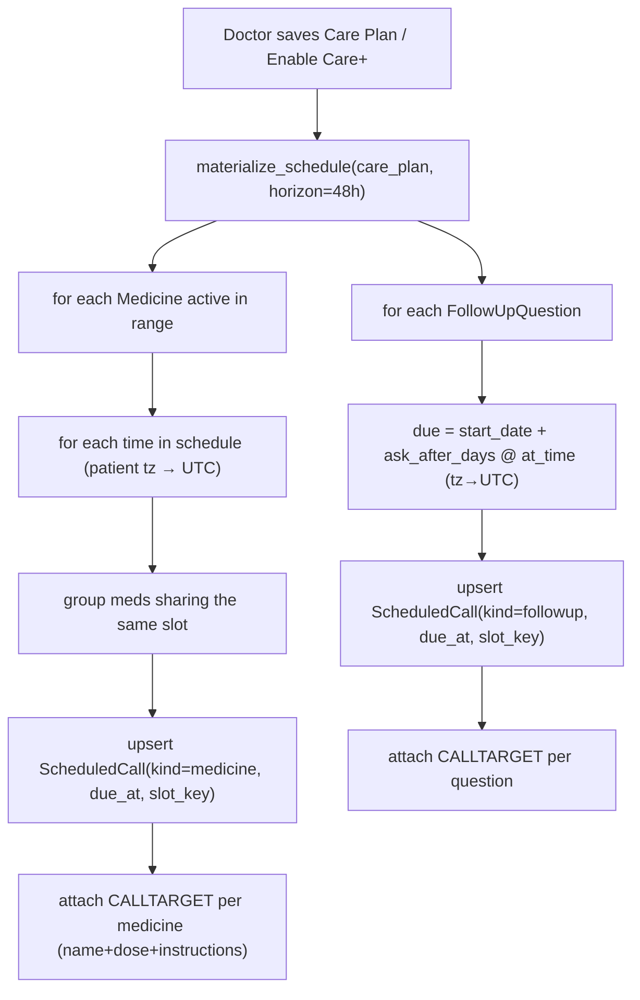

**Grouping rule:** medicines with the **same local time** are merged into **one** `ScheduledCall` (patient gets a single call listing all due meds), instead of several back-to-back calls.

### 17.4 The cron tick (runs every minute)

```mermaid
flowchart TD
  T["APScheduler tick @ every 60s (now_utc)"] --> Q["query ScheduledCall<br/>status in (pending,no_answer,failed)<br/>AND next_attempt_at <= now<br/>AND due_at <= now"]
  Q --> W{"inside CarePlan.call_window<br/>(patient local time)?"}
  W -->|no| SNZ["defer next_attempt_at → window open"]
  W -->|yes| BUILD["build call for THIS slot:<br/>resolve CALLTARGETs → medicine names/doses/instructions"]
  BUILD --> SCRIPT["LLM script (only these meds) → Translate(lang) → TTS"]
  SCRIPT --> PLACE["telephony.place_call() (twilio|sim)"]
  PLACE --> LOG["create CallLog, link scheduled_call.call_log_id, status=placed"]
  LOG --> ANS{"answered?"}
  ANS -->|completed| DONE["status=completed → STT→Analytics→CareEvents"]
  ANS -->|no answer / fail| RETRY{"attempts < max_retries?"}
  RETRY -->|yes| BACK["attempts++, next_attempt_at = now + backoff[attempts]"]
  RETRY -->|no| MISS["status=skipped → CareEvent(missed_dose) → adherence↓ → maybe escalate/caregiver"]
```

Pseudocode:

```python
def tick(now_utc):
    due = query(ScheduledCall,
                status_in=["pending", "no_answer", "failed"],
                due_at__lte=now_utc,
                next_attempt_at__lte=now_utc)
    for sc in due:
        if not within_call_window(sc, now_utc):
            sc.next_attempt_at = next_window_open(sc); continue
        targets = resolve_targets(sc)                       # the specific meds/questions
        script  = build_script(sc.kind, targets, patient)   # names ONLY for this slot
        text    = translate(script, patient.preferred_language)
        audio   = tts(text, patient.preferred_language, speaker)
        call    = telephony.place_call(patient, audio, sc)  # twilio | simulation
        sc.call_log_id, sc.status, sc.attempts = call.id, "placed", sc.attempts + 1
```

### 17.5 Per-call medicine targeting (the key requirement)

- Each `ScheduledCall` carries **exactly the medicines due at that time** via `CALLTARGET`.
- `build_script()` uses **only those** targets, so the patient hears the right drugs:
  - 08:00 → *"…time for your morning **Metformin 500mg** and **Amlodipine 5mg**, taken **after food**…"*
  - 20:00 → *"…time for your evening **Metformin 500mg**…"*
- The patient's spoken reply is matched back to each target, producing **per-medicine adherence** (`ExtractedResponse` keyed by `medicine_id`), not just a single yes/no.

### 17.6 End-to-end: dashboard → cron → call

```mermaid
sequenceDiagram
  actor Doc as Doctor (Dashboard)
  participant BE as FastAPI
  participant DB as SQLite
  participant CR as APScheduler (cron)
  participant SV as Sarvam
  participant TW as Twilio
  actor Pat as Patient
  Doc->>BE: Save Care Plan (meds, times, lang, tz, window)
  BE->>DB: upsert Medicine/FollowUpQuestion
  BE->>DB: materialize ScheduledCall + CALLTARGET (next 48h)
  loop every 60s
    CR->>DB: due & in-window ScheduledCalls?
    DB-->>CR: [slot: 08:00 → Metformin+Amlodipine]
    CR->>SV: LLM script(these meds) → Translate → TTS
    CR->>TW: place call
    TW->>Pat: "time for Metformin & Amlodipine (after food)"
    Pat-->>TW: reply
    TW->>BE: recording webhook
    BE->>SV: STT → Text Analytics (per-medicine)
    BE->>DB: CallLog + per-med adherence + CareEvents; sc.status=completed
  end
```

### 17.7 Reliability rules

- **Idempotency:** unique `slot_key` per (patient, slot, kind) — safe to run the tick continuously.
- **Timezone:** all schedule times are patient-local (`Patient.timezone`) → stored as UTC `due_at`.
- **Call window:** never dial outside `CarePlan.call_window`; out-of-window slots defer to next open time.
- **Retries:** `no_answer`/`failed` → `attempts++`, reschedule via `retry_backoff` (e.g. 15m, 1h, 4h) up to `max_retries`, then mark `skipped`.
- **Missed dose:** a `skipped` medicine slot emits a `missed_dose` CareEvent, drops adherence, and (if repeated) notifies the caregiver / raises an escalation.
- **Plan edits:** re-materialization only touches **future `pending`** slots; already `placed/completed` history is immutable.

### 17.8 Demo mode (so judges see it fire fast)

- `SCHED_TICK_SECONDS` (default 60) can be lowered for demos.
- **Time-scale** flag: interpret `ask_after_days` as minutes; add a **"Run scheduler now"** button (`POST /schedule/run-now`) and **"Simulate slot"** to trigger a specific `ScheduledCall` on demand.
- Dashboard shows an **Upcoming Calls** queue (next due slots + their target meds) and a **live status** as the cron places them.

### 17.9 New API endpoints for scheduling

| Method | Path | Purpose |
|---|---|---|
| POST | `/patients/{id}/care-plan` | Save plan → **auto-materialize** ScheduledCalls |
| POST | `/patients/{id}/schedule/rematerialize` | Rebuild future pending slots |
| GET | `/patients/{id}/schedule` | Upcoming ScheduledCalls (+ targets/status) |
| GET | `/schedule/upcoming` | Global queue for dashboard |
| POST | `/schedule/run-now` | Force a tick (demo) |
| POST | `/schedule/{scheduled_call_id}/simulate` | Fire one slot immediately (demo) |
| PATCH | `/schedule/{scheduled_call_id}` | Snooze / skip / change time |

### 17.10 Where it lives in the code

- `services/scheduler.py` — APScheduler setup + `tick()` (started in FastAPI `lifespan`).
- `services/careplus.py` — `materialize_schedule()`, `resolve_targets()`, `build_script()`.
- `services/telephony.py` — `place_call()` (twilio | simulation).
- Frontend `CarePlanBuilder` writes the config; `UpcomingCalls` component renders the queue on the dashboard/patient page.
